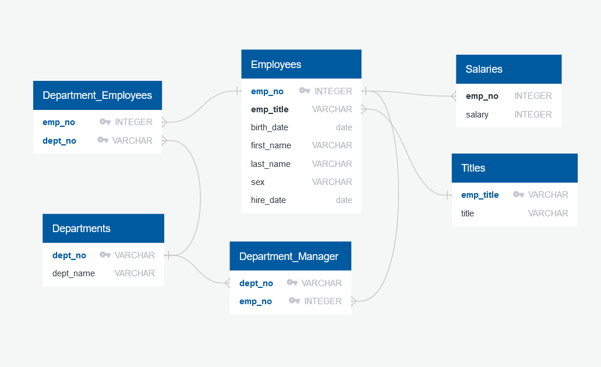
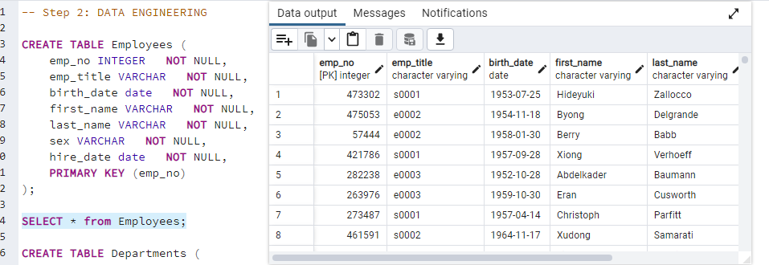
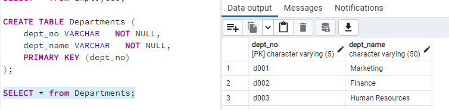
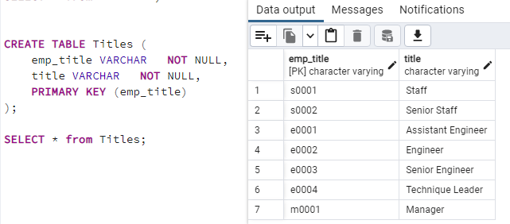
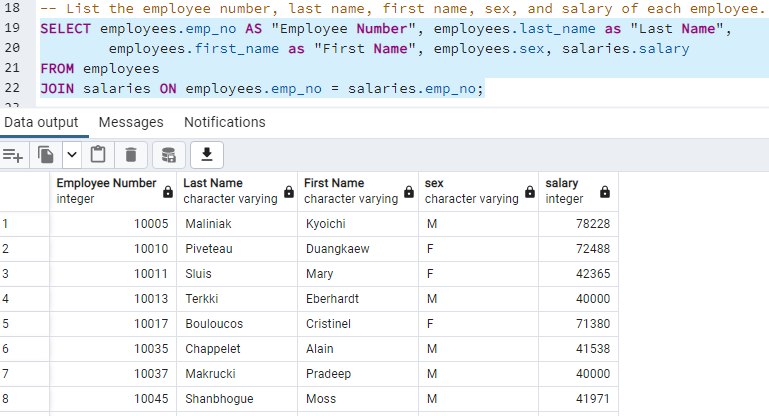
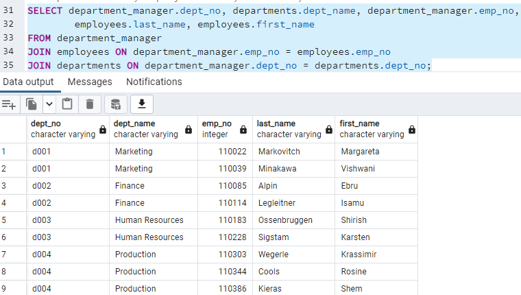
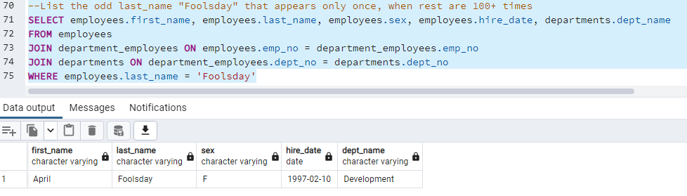
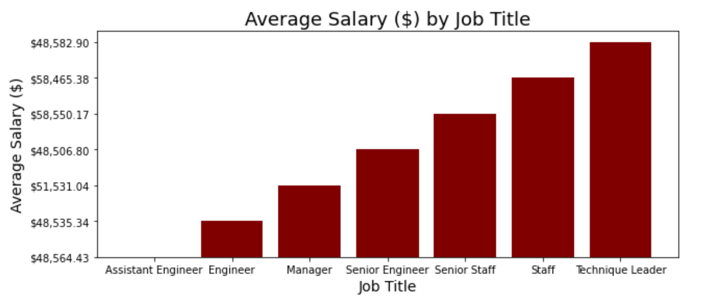
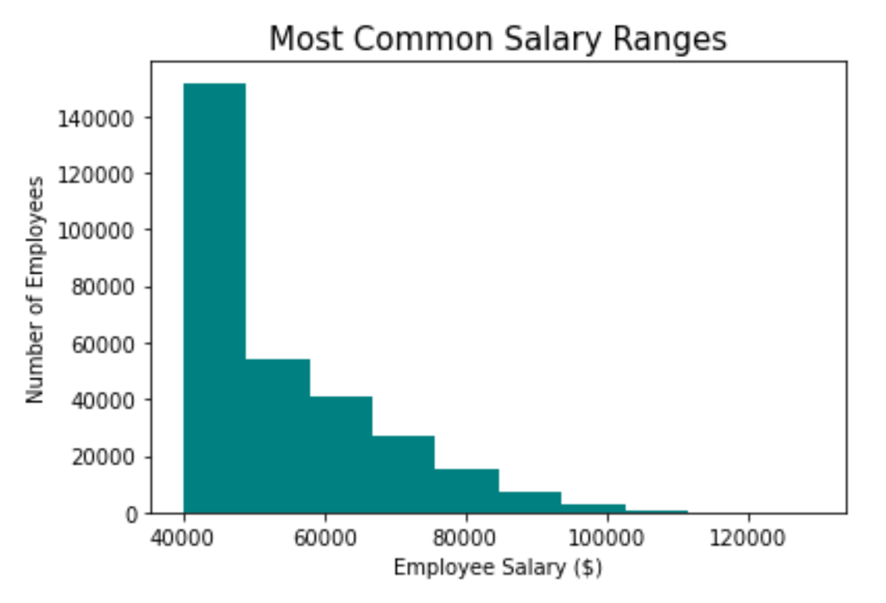

# Background

As a new data engineer at Pewlett Hackard (a fictional company), our first major task is to do a research project about people whom the company employed during the 1980s and 1990s. All that remains of the employee database from that period are six CSV files.

For this project, we have designed the tables to hold the data from the CSV files, imported the CSV files into a SQL database, and then answered questions about the data: Data Analysis

   - List the employee number, last name, first name, sex, and salary of each employee.
   - List the first name, last name, and hire date for the employees who were hired in 1986.
   - List the manager of each department along with their department number, department name, employee number, last name, and first name.
   - List the department number for each employee along with that employee’s employee number, last name, first name, and department name.
   - List first name, last name, and sex of each employee whose first name is Hercules and whose last name begins with the letter B.
   - List each employee in the Sales department, including their employee number, last name, and first name.
   - List each employee in the Sales and Development departments, including their employee number, last name, first name, and department name.
   - List the frequency counts, in descending order, of all the employee last names (that is, how many employees share each last name).
        
Following was performed: data modeling, data engineering, and data analysis, respectively.

# Data Modeling

    ERD of the Tables (created using QuickDBDLinks)

# Data Engineering

Following tables were created: Employees, Departments, Departments Employees, Department Managers, Salary, and Titles. 
Examples: 

    Employees Table 
    Departments Table 
    Titles Table 
   
# Data Analysis 

Examples of Data Analysis: 

    Employees Table 
    Managers Table 
   
After finind the last name frequesncy, we've discovered that all of the last names apprear over 100 times....exept one. 
Employee located is potentialy a fake employee and should be researched further. 

   
   

# Bonus

To confirm your hunch, you decide to create a visualization of the data to present to your boss by importing the SQL database into Pandas, creating a histogram to visualize the employee salary ranges that were the most common, and creating a bar chart of average salary by title.

By further research we are questioning the validity of data due to the fact that lower position employees have higher salary (Engineers vs. Staff) 

    Average Salary 
    Salary Comparison  

